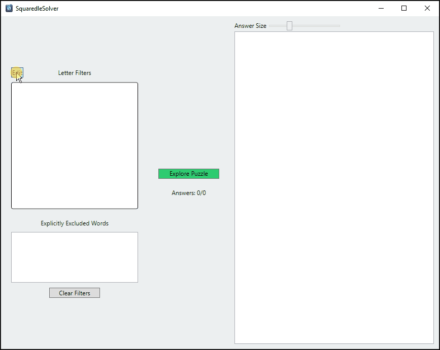
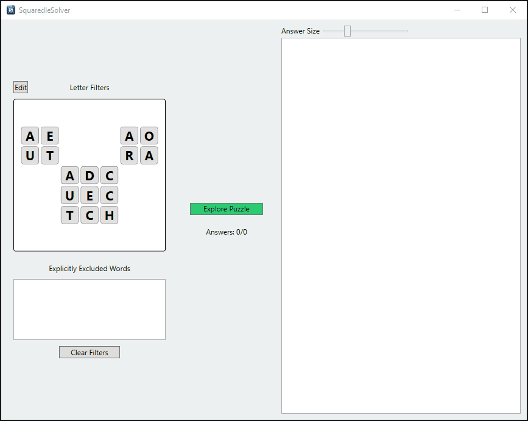
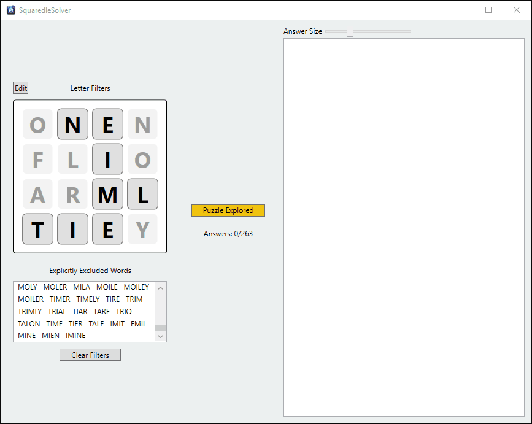

# SquaredleSolver

Cheats for Squaredle.

## What is Squaredle ?

[Squaredle](https://squaredle.app/) is a free online word search game. Words are found by drawing a path through a grid of letters. 

Try completing a [Squaredle](https://squaredle.app/) puzzle without Cheating First :)

## How can I have less fun ?

The best way to ruin the fun of a game is to cheat.

Squaredle solver does just that - it finds the words for you ... kind of.

Since the solver uses an imperfect dictionary (see [words_alpha.txt](https://github.com/dwyl/english-words)), words can be missing or not considered valid by squaredle.

## How do I use it ?

### Install

Download the installer from the [releases](https://github.com/SamuelSalam815/SquaredleSolver/releases)

### Using the solver

#### Add the puzzle letters

You can input today's puzzle using the edit button next to the letter filter:

After putting in a suitable puzzle you can click "Explore Puzzle" to run the solver. The solver will display the words it has found ordered by the tile you start the word on.

#### Track the answers you have attempted

After attempting a discovered word you can remove it from the list of answers just by clicking on it:

You can undo this by clicking on the word you discovered in the 'Explicitly Excluded Words' list.

#### Filter out unused tiles

After finding enough words, squaredle will blank out tiles that are not used for the main solution. Bonus words can still use blanked out tiles, but they won't count towards completing the puzzle.

You can toggle tiles on and off using the letter filter:

Words that pass through a 'faded' tile will be hidden. They can be shown again by toggling the tile back on and this will not affect the words you have attempted under 'Explicitly Excluded Words'

Once you find all the words for the puzzle, you might also be interested in going after bonus words. If you toggle all the tiles back on, this can be an easy way to discover bonus words - don't click 'clear all filters' if you want to go after bonus words, as this will also reset the words you have marked as attempted.

Here is an example of how I would go after bonus words :

